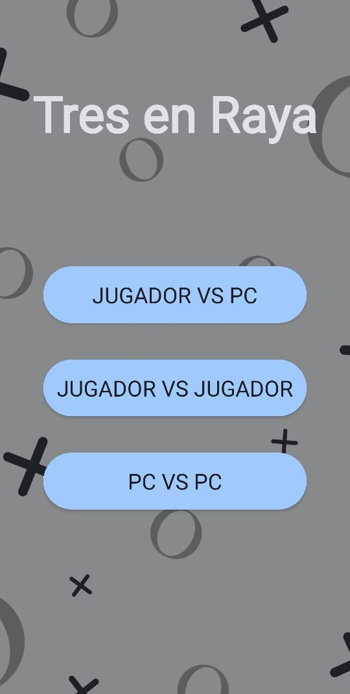
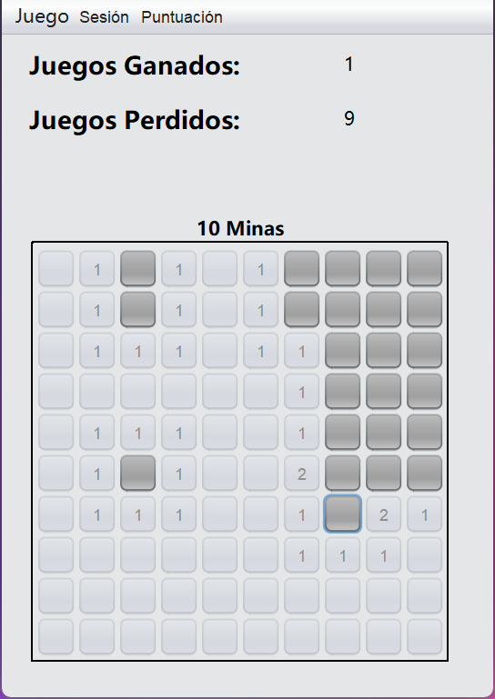
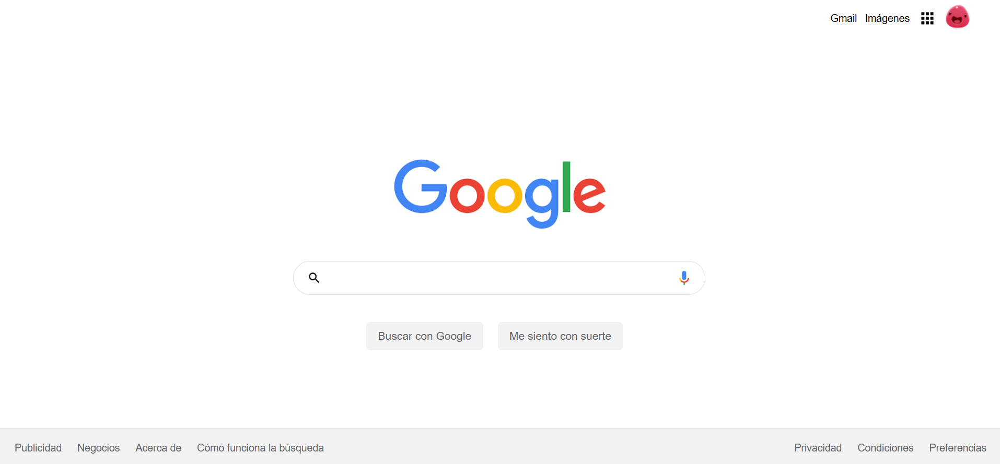

# Mi sitio personal

Este es mi sitio personal. Aquí puedes encontrar información sobre mí, mis
proyectos y mis intereses.

## Contenido
- [Acerca de mí](#acerca-de-mí)
- [Tecnologías](#tecnologías)
- [Proyectos](#proyectos)
- [Intereses](#intereses)
- [Contacto](#contacto)  

## Acerca de mí

Soy Joseph Carrera, estudiante de Ciencias de la Computación en la ESPOL, con 20 años de edad.  
Me apasiona la **inteligencia artificial** y actualmente me especializo en **desarrollo frontend**.  

Me considero una persona comunicativa, con facilidad para trabajar en equipo y aportar a proyectos colaborativos.  

## Tecnologías

## Proyectos

### 📊 App de gestión financiera personal  
Aplicación para organizar gastos e ingresos de manera sencilla.  

---

### ❌ App Tres en Raya  
Aplicación del clásico juego de tres en raya con interfaz sencilla.  

---

### 💣 Buscaminas  
Implementación del juego de buscaminas con diferentes niveles de dificultad.

---

### 🌐 Clon visual de Google.com  
Clon visual del sitio web Google.com, enfocado en la apariencia y diseño responsive.

  
## Intereses

- IA y Machine Learning
- Desarrollo web (frontend y backend)
- Videojuegos y programación de motores gráficos

## Contacto
- ✉️ Correo: jecarrer@espol.edu.ec
- 💼 [LinkedIn](www.linkedin.com/in/joseph-carrera-4b959b309) 
